<!-- omit in toc -->
# Writing cross-chain contract using `L2ToL2CrossDomainMessenger`

This guide walks through the `CrossChainPingPong.sol` contract, focusing on high level design and steps on integrating the `L2ToL2CrossChainMessenger` contract. The source code can be found [here](https://github.com/ethereum-optimism/supersim/blob/main/contracts/src/pingpong/CrossChainPingPong.sol).

- [High level overview](#high-level-overview)
  - [Diagram](#diagram)
  - [Flow](#flow)
    - [1. Contract Deployment](#1-contract-deployment)
    - [2. Initiate Game (Serve)](#2-initiate-game-serve)
    - [3. Send Cross-Chain Message](#3-send-cross-chain-message)
    - [4. Receive on Destination Chain](#4-receive-on-destination-chain)
    - [5. Continue Game (Hit)](#5-continue-game-hit)
    - [Key Points](#key-points)
- [Walkthrough](#walkthrough)
  - [Initializing contract states](#initializing-contract-states)
    - [Constructor Setup](#constructor-setup)
    - [Synchronizing the Game Start](#synchronizing-the-game-start)
    - [Reliance on CREATE2 for Cross-Chain Consistency](#reliance-on-create2-for-cross-chain-consistency)
  - [Sending a cross chain message](#sending-a-cross-chain-message)
    - [1. Encode the function call](#1-encode-the-function-call)
    - [2. Send the cross-domain message](#2-send-the-cross-domain-message)
    - [Why we're sending a `receiveBall` function call](#why-were-sending-a-receiveball-function-call)
  - [Receiving a cross chain message](#receiving-a-cross-chain-message)
    - [1. Check `msg.sender` to verify the caller](#1-check-msgsender-to-verify-the-caller)
    - [2. Check the sender of the message on the source chain](#2-check-the-sender-of-the-message-on-the-source-chain)
    - [3. Make state updates and emit events](#3-make-state-updates-and-emit-events)
- [Takeaways](#takeaways)


## High level overview

`CrossChainPingPong.sol` implements a cross-chain ping-pong game using the L2ToL2CrossDomainMessenger.
 * Players hit a virtual ** *ball* ** back and forth between allowed L2 chains. The game starts with a serve
 * from a designated start chain, and each hit increases the rally count. The contract tracks the last hitter's address, chain ID, and the current rally count.

### Diagram

```mermaid
sequenceDiagram
    participant Chain1 as Chain 1 (First serve)
    participant Chain2 as Chain 2
    
    Note over Chain1: 🚀 Game Starts
    Note over Chain1: 🏓 Serve Ball
    Chain1->>Chain2: 📤 Send PingPongBall {rallyCount: 1, lastHitter: Chain1}
    Chain1-->>Chain1: Emit BallSent event
    activate Chain2
    Note over Chain2: 📥 Receive Ball
        Chain2-->>Chain2: Emit BallReceived event

    Note over Chain2: 🏓 Hit Ball
    Chain2->>Chain1: 📤 Send PingPongBall {rallyCount: 2, lastHitter: Chain2}
    Chain2-->>Chain2: Emit BallSent event
    deactivate Chain2
    activate Chain1
    Note over Chain1: 📥 Receive Ball
        Chain1-->>Chain1: Emit BallReceived event
    Note over Chain1: 🏓 Hit Ball
    Chain1->>Chain2: 📤 Send PingPongBall {rallyCount: 3, lastHitter: Chain1}
    Chain1-->>Chain1: Emit BallSent event
    deactivate Chain1
    Note over Chain1,Chain2: Game continues...
```



### Flow

#### 1. Contract Deployment
   - Deploy identical `CrossChainPingPong.sol` contracts on multiple L2 chains.
   - Contracts are deployed using CREATE2 with the same parameter (`_allowedChainIds` and starting `_serverChainId`), resulting in the same address and initial state.

#### 2. Initiate Game (Serve)
   - Call `serveBallTo` on the designated server chain, specifying a destination chain.
   - This can only be done once to start the game.
   - Contract creates initial `PingPongBall` struct.

#### 3. Send Cross-Chain Message
   - Contract uses `L2ToL2CrossDomainMessenger` to send the ball data to the specified chain.

#### 4. Receive on Destination Chain
   - L2ToL2CrossDomainMessenger on destination chain calls `receiveBall`.
   - Contract verifies the message sender and origin.
   - Ball data is stored, and the ball is marked as present on this chain.

#### 5. Continue Game (Hit)
   - Any user on the chain currently holding the ball calls `hitBallTo` to send it to another chain.
   - Contract updates the `PingPongBall` data (increment rally count, update last hitter).
   - Process repeats from step 3.

#### Key Points
- Game starts with `serveBallTo` on a designated chain (server).
- After serving, `hitBallTo` is used to continue the game.
- Each contract instance can both send and receive balls.
- The contract tracks whether it currently holds the ball.
- Cross-chain messaging is handled by L2ToL2CrossDomainMessenger.

## Walkthrough

Here's an explanation of the functions in the contract, with a focus on how it interacts with `L2ToL2CrossChainMessenger`.

### Initializing contract states

#### Constructor Setup

```solidity
constructor(uint256[] memory _allowedChainIds, uint256 _serverChainId) {
    for (uint256 i = 0; i < _allowedChainIds.length; i++) {
        _isChainIdAllowed[_allowedChainIds[i]] = true;
    }

    if (!_isChainIdAllowed[_serverChainId]) {
        revert InvalidDestinationChain(_serverChainId);
    }

    SERVER_CHAIN_ID = _serverChainId;
}
```

This constructor initializes the contract with two crucial pieces of information:

1. **Allowed Chain IDs**: It populates the `_isChainIdAllowed` mapping, which determines which chains can participate in the game.
2. **Server Chain ID**: It sets the `SERVER_CHAIN_ID`, designating which chain has the authority to start the game.

#### Synchronizing the Game Start

The contract uses a simple mechanism to ensure the game starts correctly across all chains:

1. **Designate the server chain**:
   ```solidity
   if (SERVER_CHAIN_ID != block.chainid) {
       revert UnauthorizedServer(block.chainid, SERVER_CHAIN_ID);
   }
   ```
   Only the designated server chain can initiate the game.

2. **Only be able to serve once**
   ```solidity
   if (_hasServerAlreadyServed) {
       revert BallAlreadyServed();
   }
   _hasServerAlreadyServed = true;
   ```
   This ensures the ball is served only once, preventing multiple game initiations.

By using these checks in the `serveBallTo` function, the contract ensures that:
- The game starts from a single, predetermined chain.
- The initial serve happens only once.
- All other chains wait to receive the ball before they can participate.

Because this contract is simple, it doesn't require complex time-based coordination or post-deployment setup. The game naturally begins when the server chain calls `serveBallTo`, and other chains join the game as they receive the ball.

#### Reliance on CREATE2 for Cross-Chain Consistency

While not explicitly mentioned in the code, this contract's design implicitly assumes the use of CREATE2 for deployment. Here's why CREATE2 is crucial for this setup:

1. **Predictable Addresses**: 
   CREATE2 enables deployment at the same address on all chains, crucial for cross-chain message verification:

   ```solidity
   if (IL2ToL2CrossDomainMessenger(MESSENGER).crossDomainMessageSender() != address(this)) {
       revert InvalidCrossDomainSender();
   }
   ```

2. **Self-referential Messaging**:
   The contract sends messages to itself on other chains:

   ```solidity
   IL2ToL2CrossDomainMessenger(MESSENGER).sendMessage(_toChainId, address(this), _message);
   ```
   This requires `address(this)` to be consistent across chains.

3. **Initialization State Considerations**:
   The constructor parameters (`_allowedChainIds` and `_serverChainId`) affect the contract's initialization state. Different values will result in different contract addresses when using CREATE2. To maintain address consistency:
   - Use identical `_allowedChainIds` arrays (same values in the same order)
   - Use the same `_serverChainId`
   across all chain deployments.

Without CREATE2, you would need to:
- Manually track contract addresses for each chain.
- Implement a more complex initialization process to register contract addresses across chains.
- Potentially redesign the security model that relies on address matching.


### Sending a cross chain message

Two functions initiate a message send

- `serveBallTo`: This function initiates the game by serving the ball from the designated server chain to another chain.

- `hitBallTo`: This function is used to hit the ball to another chain after receiving it.

Both functions create a new `PingPongBall` struct with updated information and then call `_sendCrossDomainMessage` to transmit this ball data to the specified destination chain.

Now, let's look at how `_sendCrossDomainMessage` works:

```solidity
function _sendCrossDomainMessage(PingPongBall memory _ball, uint256 _toChainId) internal {
    bytes memory _message = abi.encodeCall(this.receiveBall, (_ball));
    IL2ToL2CrossDomainMessenger(MESSENGER).sendMessage(_toChainId, address(this), _message);
}
```

#### 1. Encode the function call

```solidity
bytes memory _message = abi.encodeCall(this.receiveBall, (_ball));
```

- The encoded message includes the function selector for `receiveBall` and the ABI-encoded `_ball` struct.
- By encoding a call to `receiveBall`, we're instructing the destination chain's messenger to execute this function when it receives the message.

#### 2. Send the cross-domain message

```solidity
IL2ToL2CrossDomainMessenger(MESSENGER).sendMessage(_toChainId, address(this), _message);
```

- Calls the `sendMessage` function on the `L2ToL2CrossDomainMessenger` to initiate cross-chain communication.
- Parameters:
  - `_toChainId`: Specifies the destination chain.
  - `address(this)`: Ensures the message appears to come from the corresponding `CrossChainPingPong` contract on the receiving chain.
  - `_message`: The encoded function call created in step 1.
- Relies on the `L2ToL2CrossDomainMessenger` to securely bridge the message to the specified chain.


#### Why we're sending a `receiveBall` function call

- We're not directly calling `receiveBall` on another chain. Instead, we're sending a message to the `L2ToL2CrossDomainMessenger` on the destination chain.
- This message instructs the messenger to execute the `receiveBall` function on our behalf.
- The process works like this:
  1. Our contract encodes a call to `receiveBall` with the ball data.
  2. We send this encoded call to the `L2ToL2CrossDomainMessenger` on the current chain.
  3. The messenger system relays this to the corresponding messenger on the destination chain.
  4. The destination chain's messenger receives the message and executes the encoded `receiveBall` call on our contract.

### Receiving a cross chain message

```solidity
function receiveBall(PingPongBall memory _ball) external {
    if (msg.sender != MESSENGER) {
        revert CallerNotL2ToL2CrossDomainMessenger();
    }

    if (IL2ToL2CrossDomainMessenger(MESSENGER).crossDomainMessageSender() != address(this)) {
        revert InvalidCrossDomainSender();
    }

    _receivedBall = _ball;
    _isBallPresent = true;

    emit BallReceived(IL2ToL2CrossDomainMessenger(MESSENGER).crossDomainMessageSource(), block.chainid, _ball);
}
```

#### 1. Check `msg.sender` to verify the caller

```solidity
  if (msg.sender != MESSENGER) {
      revert CallerNotL2ToL2CrossDomainMessenger();
  }
```

 - The `receiveBall` function must only be called by the trusted `L2ToL2CrossDomainMessenger`. This messenger is responsible for handling cross-chain messages securely, so we need to verify that it is indeed the caller.
 - Without this check, any external user could directly call `receiveBall` and pass arbitrary `_ball` data, bypassing the intended cross-chain communication flow.
 - We rely on `L2ToL2CrossDomainMessenger` to ensure that:
   - The function is only triggered by a valid message sent from another chain.
   - The source chain's sender address and chain ID are correctly relayed.
   - Messages can’t be replayed or sent twice, preserving game integrity.

#### 2. Check the sender of the message on the source chain

```solidity
  if (IL2ToL2CrossDomainMessenger(MESSENGER).crossDomainMessageSender() != address(this)) {
      revert InvalidCrossDomainSender();
  }
```

- The second check ensures that the message originated from the correct `CrossChainPingPong` contract on the source chain (the chain where someone called `hitBallTo`).
  - Leverages the fact that CrossChainPingPong contracts are deployed identically across chains, using deterministic deployment methods like CREATE2.
- Without verifying this, any contract on a different chain could send an arbitrary `_ball` through the messenger, potentially disrupting the game's state.
- Since the `CrossChainPingPong` contract is deployed with identical logic across chains, we trust that only the intended contract would trigger this message in the correct game context.

#### 3. Make state updates and emit events

```solidity
  _receivedBall = _ball;
  _isBallPresent = true;

  emit BallReceived(IL2ToL2CrossDomainMessenger(MESSENGER).crossDomainMessageSource(), block.chainid, _ball);
```

Updates the contract on this chain to keep the state of the ball and mark that it's present on this chain.

## Takeaways

This is just one of many patterns to use the L2ToL2CrossDomainMessenger in your contract to power cross-chain calls. Key points to remember:

1. **Simple Message Passing**: This design sends simple messages between identical contracts on different chains. Each message contains only the essential game state (rally count, last hitter). More complex systems might involve multiple contracts, intermediary relayers.

2. **Cross-Chain Sender Verification**: Always verify the sender of cross-chain messages. This includes checking both the immediate caller (the messenger) and the original sender on the source chain.

3. **Cross-Chain Contract Coordination**: This design uses CREATE2 for consistent contract addresses across chains, simplifying cross-chain verification. Alternative approaches include:
   - Beacon proxy patterns for upgradeable contracts
   - Post-deployment setup where contract addresses are specified after deployment
